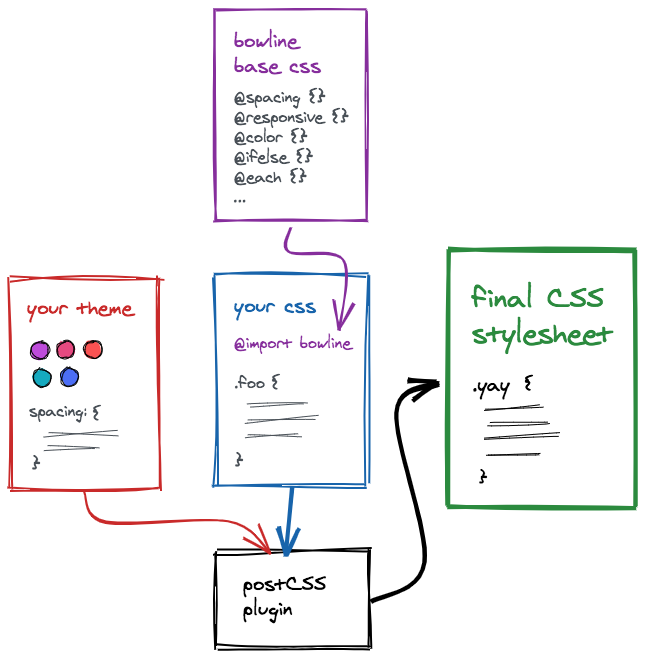
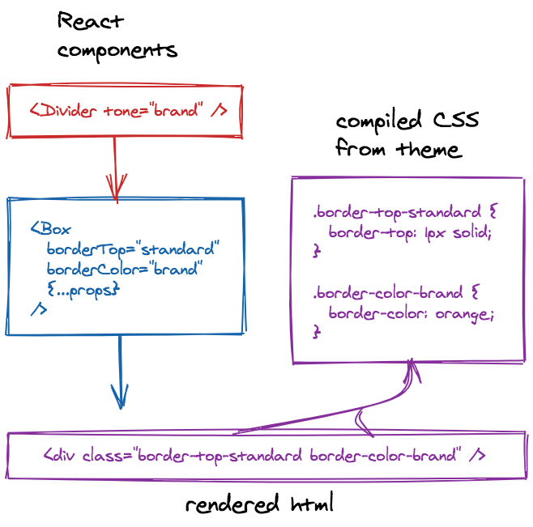

# How it works

## Basics

At its core, Bowline is collection of React components backed by static CSS utility classes, with a PostCSS plugin that can be added to most existing CSS workflows.

Styles are authored in plain CSS files using a SCSS-like syntax along with our own custom at-rule directives and functions. The resulting base stylesheet is compiled at build time against your own theme configuration.

<Box />

## Components

Bowline components implement a token-based styling prop API that maps to the global utility classes. The most foundational of these components is `Box`, with props that mirror common CSS properties. Components in the system all build upon Box – each employing its own higher-level styling API.

<Box />

